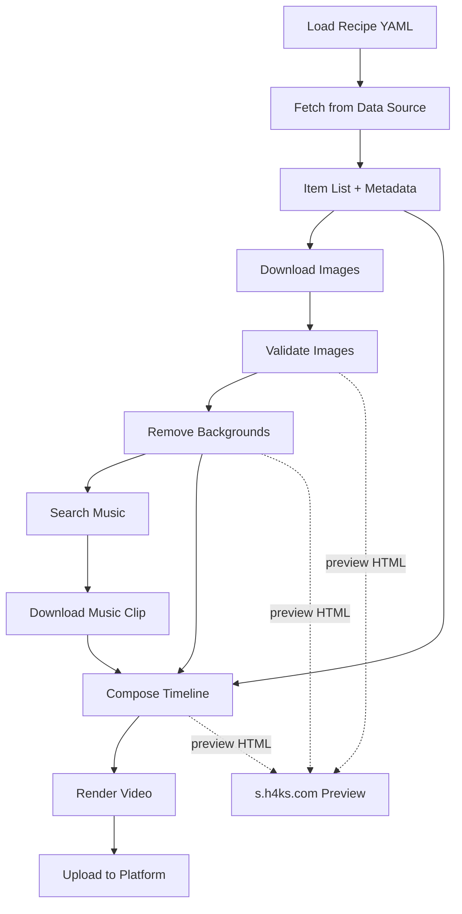

# VidForge — AI Plan & Architecture Notes

> This folder contains AI-generated plans, decisions, and working notes.
> Not meant for human review — reference docs for the AI across sessions.

## What is VidForge

A modular video generation system that takes data from multiple sources, composes them
into structured video timelines using reusable effects/templates, and outputs to multiple
platform targets. Designed to run on GitHub Actions (cron) for free.

## Repo Name: `vidforge`

Short, memorable, conveys: video + forge (building/crafting).

## High-Level Architecture

```
┌──────────────────────────────────────────────────────────┐
│                     RECIPE (YAML)                        │
│   What to build, which sources, which targets            │
└──────────────────────┬───────────────────────────────────┘
                       ▼
┌──────────────────────────────────────────────────────────┐
│                   DATA SOURCES                           │
│   Fandom Wiki | AniList | Jikan | Custom YAML            │
│   Each source → list[Item]                               │
└──────────────────────┬───────────────────────────────────┘
                       ▼
┌──────────────────────────────────────────────────────────┐
│                   ASSET PIPELINE                         │
│   Download images → validate → bg remove → resize        │
│   Search music → download clip                           │
│   Cache everything by content hash                       │
└──────────────────────┬───────────────────────────────────┘
                       ▼
┌──────────────────────────────────────────────────────────┐
│                 TIMELINE COMPOSITOR                      │
│   Intro scene → content scenes → outro                   │
│   Reusable templates: comparison, countdown, slideshow   │
│   Reusable effects: scroll, zoom, fade, kinetic text     │
└──────────────────────┬───────────────────────────────────┘
                       ▼
┌──────────────────────────────────────────────────────────┐
│                  PLATFORM TARGETS                        │
│   YouTube (16:9) | YouTube Shorts (9:16)                 │
│   TikTok (9:16) | Instagram Reels (9:16)                │
│   Each target: resolution, max duration, safe zones      │
└──────────────────────┬───────────────────────────────────┘
                       ▼
┌──────────────────────────────────────────────────────────┐
│                    UPLOAD                                │
│   YouTube Data API v3 | TikTok API | manual fallback    │
│   Credentials from GitHub Secrets                       │
└──────────────────────────────────────────────────────────┘
```

## Tech Stack

| Layer | Technology | Why |
|-------|-----------|-----|
| Core language | Python 3.11+ | Proven in PoC, all deps available |
| DAG orchestration | Apache Hamilton | Lightweight, no server, HTML export, function-as-DAG |
| Rendering | ffmpeg (subprocess) | Industry standard, preinstalled on GitHub runners |
| Image processing | Pillow, rembg, numpy, scipy | Proven in PoC |
| Data models | Pydantic v2 | Validation, serialization |
| CLI | Typer | Modern, auto-generated help |
| Config | YAML | Human-readable recipes, character data, target presets |
| Visualization | Hamilton (DOT/SVG/HTML) + Mermaid (README) | Auto-generated DAG diagrams |
| Music | yt-dlp | YouTube search + download |
| Upload | google-api-python-client | YouTube Data API v3 |
| CI/CD | GitHub Actions | Free on public repos, cron scheduling |
| Caching | actions/cache + content-hash local | Avoid re-downloading/re-processing |

## Key Design Principles

1. **Sources produce Items** — they don't know about video
2. **Effects are pure filter graphs** — composable, stateless
3. **Templates combine items + effects** — reusable across video types
4. **Targets are presets** — one timeline renders to multiple platforms
5. **Everything caches by content hash** — re-render without re-fetching
6. **Every step testable in isolation** — run pipeline up to any node
7. **No server, no database** — pure Python, file-based, CI-friendly

## Hamilton DAG Pipeline

The pipeline for a typical anime heights video:



## Content Types (future pipelines)

- **Anime Heights** — character height comparison scroll
- **Top 10 Countdown** — ranked list with reveals
- **Tier List** — S/A/B/C/D tier ranking
- **Fact Compilation** — interesting facts about a topic
- **Before/After** — transformation comparison

## Reusable Components

### Templates
- `intro` — Show/series name + animated text + music sync
- `outro` — CTA (subscribe, like), next video teaser
- `comparison` — Side-by-side or overlay comparison (heights, stats)
- `countdown` — #10 to #1 with reveal animations
- `slideshow` — Images with transitions
- `ranking` — Tier list grid layout

### Effects
- `scroll` — Vertical/horizontal continuous scroll
- `zoom` — Ken Burns slow zoom in/out
- `fade` — Fade in/out between scenes
- `slide` — Slide transitions (wipe, push)
- `kinetic_text` — Animated text with emphasis
- `pulse` — Scale pulse/bounce effect
- `countdown_reveal` — Number countdown with image reveal

### Filmstrip Concept
A "filmstrip" is a pre-composed sequence of templates+effects that can be reused:
```
standard_anime_video = intro + content_scenes + outro
```
Different content types plug into the middle. Intros/outros can be
shared across all video types.

## Platform Targets

| Target | Resolution | Max Duration | Aspect | Notes |
|--------|-----------|-------------|--------|-------|
| YouTube | 1920x1080 | 15 min | 16:9 | Longform |
| YouTube Shorts | 1080x1920 | 60s | 9:16 | Vertical |
| TikTok | 1080x1920 | 3 min | 9:16 | Vertical |
| Instagram Reels | 1080x1920 | 90s | 9:16 | Vertical |

Each target has:
- Resolution + aspect ratio
- Max duration (enforced by renderer)
- Safe zones (text margins for platform UI)
- Style preset (font sizes, animation speeds, text colors)
- Upload credentials (from GitHub Secrets)

## GitHub Actions Workflow

```yaml
name: Generate Videos
on:
  schedule:
    - cron: '0 12 * * 1'  # Weekly Monday noon UTC
  workflow_dispatch:       # Manual trigger

jobs:
  generate:
    runs-on: ubuntu-latest  # 4 CPU, 16GB RAM, 14GB SSD
    steps:
      - uses: actions/checkout@v4
      - uses: actions/cache@v4
        with:
          path: ~/.cache/vidgen
          key: vidgen-${{ hashFiles('config/characters/*.yaml') }}
      - run: pip install -e .[all]
      - run: vidforge generate --recipe config/recipes/anime_heights_dbz.yaml --target youtube
      - run: vidforge upload --platform youtube
```

## GitHub Pages

- Auto-generated DAG visualization (HTML) from Hamilton
- Mermaid diagram in README.md
- Preview thumbnails of generated videos
- Pipeline run history

## Credentials

Stored as GitHub Secrets, accessed in Actions:
- `YOUTUBE_CLIENT_ID`
- `YOUTUBE_CLIENT_SECRET`
- `YOUTUBE_REFRESH_TOKEN`
- `TIKTOK_SESSION_ID` (when API available)

## Lessons from PoC (memory/2026-04-02.md)

- rembg: two-pass (fast default, alpha_matting only when content < 50% fill)
- Image filtering: content ratio < 0.75 = full body, > 0.75 = face crop
- Fandom wiki: use correct page names, batch API calls
- Heights: always cm for humans, meters for giants
- Skip keyword "key" matches "Monkey" — removed
- Stray `continue` bugs are silent killers — always add logging

## Code Quality Policy

### Testing
- **Coverage gate: 80% minimum** — enforced on git push via pre-commit
- **pytest** with `--strict-markers -x` (fail fast on first error)
- Every new module gets a `tests/test_<module>.py` with at least basic tests
- Tests for data validation (Pydantic models), edge cases, error paths
- `TODO` stubs are excluded from coverage (`exclude_lines`)
- CLI and `__init__.py` are excluded from coverage

### Linting & Formatting
- **ruff** — lint (isort, pyupgrade, flake8-bugbear, simplify, ruff rules)
- **ruff format** — double quotes, 4-space indent, 100 char line length
- **pre-commit hooks** fire on every `git commit`:
  - ruff check + format
  - YAML/TOML validation
  - No trailing whitespace / missing EOF
  - No scoped imports (all imports at top of file)
  - No relative imports in `src/` (always `from vidforge.xxx`)
  - No files > 500KB
- **On `git push`** (CI enforcement):
  - pytest with coverage gate (≥80%)
  - No direct commits to `main`

### Package Management
- **uv** — fast, deterministic, locked deps via `uv.lock`
- All commands run via `uv run` (auto-activates venv)
- `pyproject.toml` is the single source of truth for deps

### Review Checklist (self-enforced before commits)
- [ ] New code has tests
- [ ] `uv run pytest --cov` passes
- [ ] `uv run ruff check src/ tests/` passes
- [ ] No scoped or relative imports
- [ ] Data validation tested (Pydantic models)
- [ ] TODO stubs filled in or explicitly left with tests skipped


## Open Questions

- [ ] Cron frequency? Weekly? Per-show rotation?
- [ ] Multiple recipes per run or one at a time?
- [ ] How to handle shows with poor image sources (AoT, Death Note)?
- [ ] Music licensing for YouTube monetization?
- [ ] TikTok API availability (unofficial/limited)
- [ ] Should we support custom user-submitted character data?
