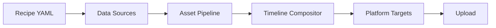
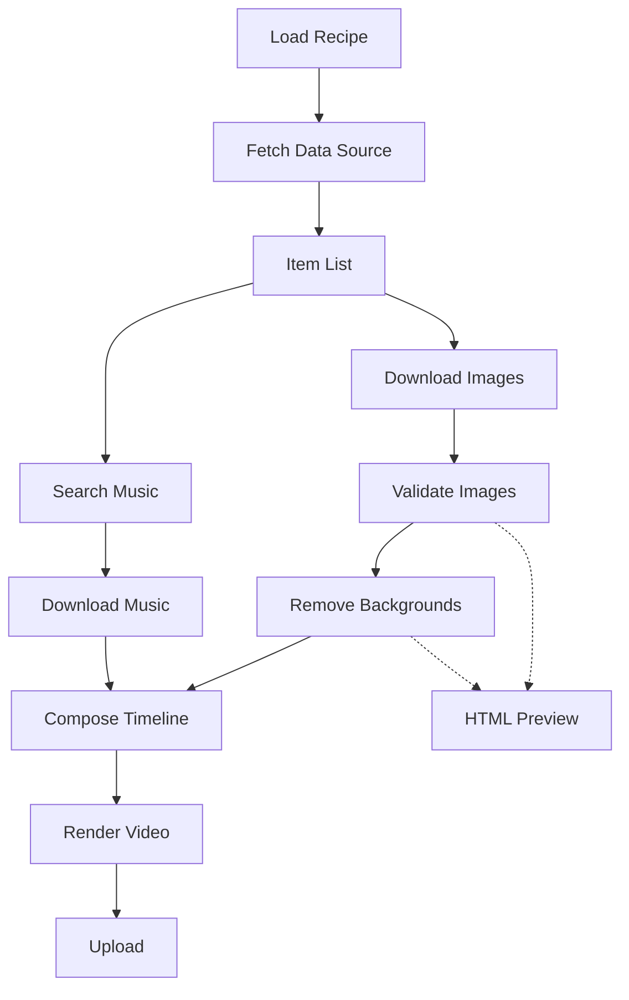

# VidForge

Modular AI-powered video generation system. Takes data from multiple sources, composes structured video timelines using reusable effects and templates, and outputs to multiple platforms.

Built to run on GitHub Actions for free — no server, no database, just Python + ffmpeg.

## How It Works

1. **Define a recipe** (YAML) — what data, what style, which platforms
2. **Hamilton DAG** orchestrates the pipeline — fetch → process → compose → render → upload
3. **Reusable templates** (intro, outro, comparison, countdown) plug into a filmstrip
4. **One render, many targets** — same content outputs to YouTube, TikTok, Reels

## Architecture



See [`.ai/PLAN.md`](.ai/PLAN.md) for full architecture notes and AI working docs.

## Quick Start

```bash
pip install -e ".[all]"
vidforge generate --recipe config/recipes/anime_heights_dbz.yaml --target youtube
vidforge upload --platform youtube
```

## Pipeline DAG



## Project Structure

```
vidforge/
├── .ai/                    # AI planning docs (not for human review)
├── src/vidforge/
│   ├── sources/            # Data ingestion (Fandom, AniList, Jikan, custom)
│   ├── assets/             # Image processing, bg removal, music, caching
│   ├── effects/            # Reusable ffmpeg filter effects
│   ├── templates/          # Scene templates (intro, outro, comparison, etc.)
│   ├── compositor/         # Timeline builder + ffmpeg renderer
│   ├── targets/            # Platform output configs
│   └── upload/             # Platform publishing
├── config/
│   ├── recipes/            # Video recipes (YAML)
│   ├── characters/         # Character data files
│   └── targets/            # Target presets
├── .github/workflows/      # GitHub Actions (cron + manual)
└── tests/
```

## License

MIT
