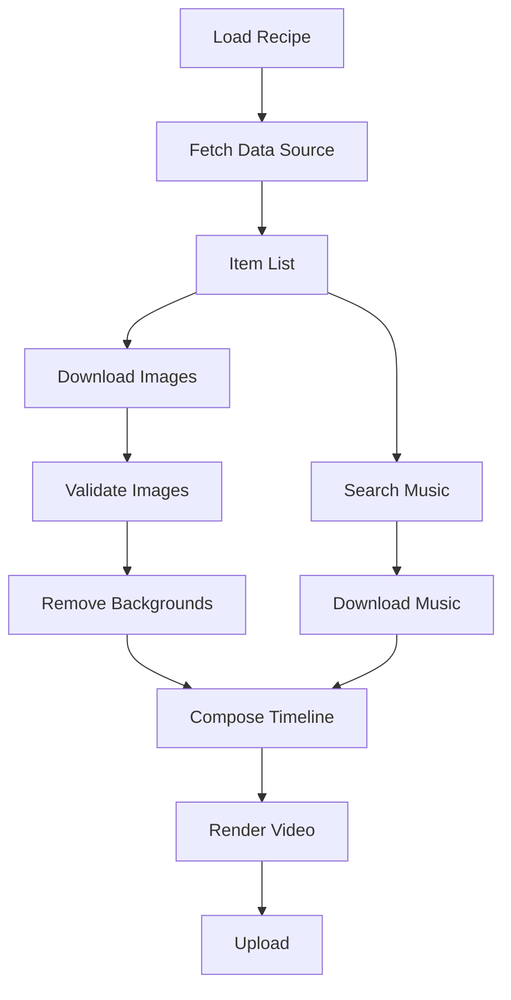

# VidForge

Modular video generation system. Takes data from multiple sources, composes structured video timelines using reusable effects and templates, and outputs to multiple platforms.

Built to run on GitHub Actions for free — no server, no database, just Python + ffmpeg.

**🔗 Live Pipeline DAG:** [h4ksclaw.github.io/vidforge](https://h4ksclaw.github.io/vidforge/) — interactive viewer with pan/zoom, code links, and auto-generated from the Hamilton DAG.

## How It Works

1. **Pick a generator** — each generator is a self-contained pipeline (heights, power ranks, countdown, etc.)
2. **Define a recipe** (YAML) or pass inputs programmatically — what data, what style, which platforms
3. **Hamilton DAG** orchestrates the pipeline — fetch → process → compose → render → upload
4. **One render, many targets** — same content outputs to YouTube, TikTok, Reels

## Architecture

```
vidforge/
├── src/vidforge/
│   ├── generators/         # Self-contained video generators
│   │   ├── base.py         # BaseGenerator ABC
│   │   ├── __init__.py     # Generator registry
│   │   └── heights/        # Anime height comparison generator
│   │       ├── pipeline.py # Hamilton DAG functions
│   │       └── debug/      # Heights-specific debug scripts
│   ├── sources/            # Data ingestion (Fandom, AniList, Jikan, custom)
│   ├── assets/             # Image processing, bg removal, music, caching
│   ├── effects/            # Reusable ffmpeg filter effects
│   ├── templates/          # Scene templates (intro, outro, comparison, etc.)
│   ├── compositor/         # Timeline builder + ffmpeg renderer
│   ├── targets/            # Platform output configs
│   └── upload/             # Platform publishing
├── config/
│   ├── recipes/            # Video recipes (YAML)
│   ├── characters/         # Character data files
│   └── targets/            # Target presets
├── .github/workflows/      # CI (lint/test), Generate, Pages
└── tests/
```

### Adding a New Generator

1. Create `src/vidforge/generators/<name>/__init__.py` — define a class extending `BaseGenerator` and call `register()`
2. Create `src/vidforge/generators/<name>/pipeline.py` — Hamilton DAG functions
3. Optionally add `debug/` for generator-specific debug scripts
4. The DAG visualization page updates automatically

### Python API

```python
from vidforge.generators import discover_all

# Discover all available generators
generators = discover_all()

# Use a specific generator
from vidforge.generators import get
gen = get("heights")
video_path = gen.run(recipe_path="config/recipes/anime_heights_dbz.yaml")
```

## Quick Start

```bash
pip install -e ".[all]"
vidforge generate config/recipes/anime_heights_dbz.yaml
```

## Pipeline DAG



## License

MIT
